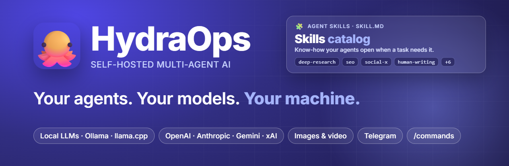

<p align="center">
  <a href="https://hydraops.org"></a>
</p>

# HydraOps Skills

The official skills catalog for [HydraOps](https://github.com/TraX22/HydraOps), the
open-source multi-agent desktop app. Skills give HydraOps agents reusable procedures:
how to research properly, audit a page for SEO, review a pull request, write for a given
social network, and so on.

You can install these skills from inside the app (**Tools → Skills**) or copy them by hand.

## Skills

| Skill | What it does |
|---|---|
| [deep-research](deep-research/) | Multi-step research with verified sources and confidence levels |
| [seo](seo/) | On-page SEO audit with a prioritized fix list |
| [github](github/) | Reading repos, triaging issues, reviewing PRs and writing on GitHub |
| [human-writing](human-writing/) | Natural, human-sounding prose in any language |
| [skill-creator](skill-creator/) | How to write a new skill for HydraOps |
| [social-x](social-x/) | Posts, threads and replies for X |
| [social-youtube](social-youtube/) | Titles, descriptions, chapters, thumbnails, scripts and Shorts |
| [social-tiktok](social-tiktok/) | Short-video scripts, captions and hashtags for TikTok |
| [social-instagram](social-instagram/) | Reels, carousels, captions and Stories |
| [social-linkedin](social-linkedin/) | Professional posts and document carousels |

## Format

Each skill is a folder following the open [Agent Skills](https://agentskills.io) format:

```
skill-name/
  SKILL.md          required: YAML frontmatter + Markdown instructions
  references/*.md   optional: detail the agent opens only when needed
  templates/*.md    optional: output templates
```

Frontmatter used in this catalog:

```yaml
---
name: skill-name            # must match the folder name
description: What the skill does and when to use it.
metadata:
  author: HydraOps
  version: 1.0.0
  tools: [web_search, fetch_url]   # HydraOps tools the skill relies on
---
```

Agents only see each skill's name and description until they need it, then read
`SKILL.md`, then individual reference files. That keeps the context small.

Skills in this catalog are **Markdown only**: no scripts or executables.

Some skills contain platform facts (character limits, formats) that change over time.
They are marked "as of <month year>" and tell the agent to re-check when it matters.

## Manual installation

Copy a skill folder (for example `deep-research/`) into the `skills` folder inside your
HydraOps data folder:

| Setup | Folder |
|---|---|
| Windows (installed app) | `%APPDATA%\HydraOps\data\skills\` |
| macOS | `~/Library/Application Support/HydraOps/data/skills/` |
| Linux | `~/.config/HydraOps/data/skills/` |
| From source | `skills/` at the repository root |

The exact path is shown at the bottom of the Skills card in the app. See
[the HydraOps manual](https://github.com/TraX22/HydraOps/blob/main/docs/en/09-tools.md#skills-know-how-for-the-agents)
for permissions and how agent-created skills are approved.

## Contributing

Contributions are welcome through pull requests.

- One folder per skill; the folder name must equal the `name` in the frontmatter
  (lowercase letters, digits and hyphens).
- Markdown files only.
- The description must say what the skill does and when to use it.
- Keep `SKILL.md` short (ideally under 250 lines) and move long material to
  `references/`.
- No secrets, personal data, URLs with tokens, or instructions that bypass safety
  controls or tell an agent to ignore its user.
- Write in English.
- Run `node scripts/build-index.mjs` to regenerate `index.json`; it fails if a skill
  breaks the rules above.

Every pull request is reviewed before merge.

## License

Apache License 2.0.
